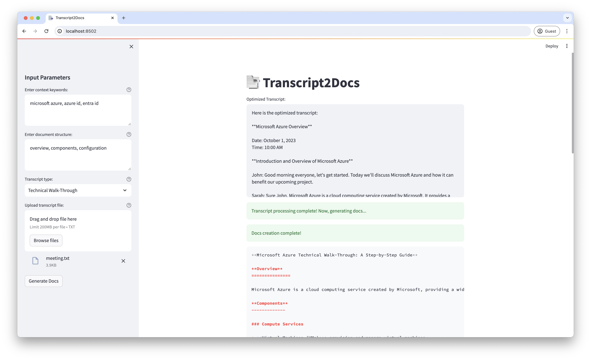

# :bookmark_tabs: Transcript2Docs



## Overview

Creating documentation is what everyone needs, but rarely anyone wants to take up. That’s why continuously, knowledge is shared in endless handover meetings and similar sessions. At the same time, providers like Google or Microsoft offer the ability to get transcripts and summaries as part of their copilots. However, all of these general-purpose services and base models have one central problem: they lack context, which can lead to semantic errors, especially in domain-specific or technical contexts.

For example, in my daily life, I handle a lot of domain specific topics which all of a sudden got interpreted incorrectly by the automated transcription:

- “Microsoft Azure ID” became “Microsoft Your ID”
- “Microsoft Entra ID” was transcribed as “Microsoft Enter ID”
- “Tag property” was understood as “Peck property”

The problem is, without context-based optimization, these semantic errors persist downstream, making it impossible to derive real benefit from the information. Without correction, you cannot leverage the capabilities of LLMs to, for instance, write up documents automatically, as they will also lack context. Hence, these errors will be inherited, making the information useless, especially in technically critical environments.

That's why I came up with :bookmark_tabs: **Transcript2Docs**. It takes the transcript from any provider (e.g., Google Meet), allows users to provide semantic context by keywords, and specify the structure of the output document they want (e.g., introduction, key points, summary) and the type of meeting. The application then corrects the transcript and crafts a compelling document out of it. The main use case is for technical documentation, where handover sessions or trainings can be simply recorded and then converted into detailed documentation later.

**Note: This is not aiming to be a production-ready application. My main motivation is to showcase the real benefit of hybrid use cases with programmatic operations on LLMs combined with a “human in the loop”.**

## Solution Overview


### Features

- **Contextual Transcript Correction**: Automatically corrects the transcript based on the provided context.
- **Custom Document Structure**: Create documents with a user-defined structure.
- **Multiple Meeting Types**: Supports various types of meetings like Live Tutorial, Technical Walk-Through, Knowledge Sharing, and General Meeting.
- **Easy Integration**: Works with transcripts from any provider.
- **Modular LLM Configuration**: Based on LangChain, you can configure the provider, model, and temperature individually for each chain (including localhost models supported by Ollama).
- **Configurable Chains**: Chains are configurable through the YAML files `transcript.yaml` and `docs.yaml`.

### Components
- **Streamlit for UI**: Streamlit is an open-source app framework used to create interactive web applications. It provides a simple and efficient way to build and deploy user interfaces for the application, allowing users to upload transcripts, input context, and specify document structure.
- **LangChain for Programmatic Operations and Text Splitting**: LangChain is a powerful library that facilitates programmatic operations such as text processing and splitting. It is used to manage the complex workflows involved in handling and processing large text data, ensuring that the documents are chunked appropriately according to token limits.

### LLMs
- **OpenAI:** Any model offered by OpenAI that is supported by the ChatOpenAI API can be leveraged.
- **Anthropic:** Hosted LLMs provided by Anthropic can be used (e.g., Claude 3).
- **Ollama:** To support privacy-sensitive tasks, any locally installed and run model from Ollama can be used.

**For more information on how to set the models up, see [Configuration](#configuration)**

### Workflow
1. **Transcript Upload**: The transcript from the meeting (e.g., Google Meet) is uploaded via the Streamlit UI. Along with the transcript, users provide essential information about the context and structure of the desired document.
2. **Document Chunking**: Using LangChain, the document is split into smaller chunks based on a predefined token limit. This step ensures that each chunk is manageable for the LLM to process without exceeding its token constraints.
3. **First Chain Processing**: The first chain iterates in a loop over each chunk of the document. Each chunk is submitted individually to the OpenAI LLM to ensure that the model pays close attention to every detail and does not deviate from the original content.
4. **Chunk Retrieval and Merging**: After processing each chunk, the results are retrieved and stored in an array. Once all chunks have been processed, they are merged together to form a cohesive document.
5. **Second Chain Initialization**: The second chain is initialized with a specific prompt to write the documentation based on the provided structure. This step involves instructing the LLM to organize and format the content according to the user's requirements.
6. **Final Document Presentation**: The final document is presented in Markdown format. This presentation allows for easy editing, sharing, and further refinement if needed.

## Installation

1. **Clone the repository:**
   ```sh
   git clone https://github.com/dataenthusiast-io/transcript2docs.git
   cd Transcript2Docs
   ```

2. **Set up a virtual environment:**
   ```sh
   python -m venv venv
   source venv/bin/activate
   ```

3. **Install the required dependencies:**
   ```sh
   pip install -r requirements.txt
   ```

4. **Enable LLM:**
   
   Either configure an API key to a proprietary model:
   ```sh
   echo "OPENAI_API_KEY=your_openai_api_key_here" > .env
   ```
   or get [Ollama](https://github.com/ollama/ollama/tree/main) installed to use local models.

## Configuration

Make sure to review the YAML files for chains and adjust models and prompts if required:

```sh
lib/chains/transcript.yaml
lib/chains/docs.yaml
```
### Chain Configuration
You can configure the LLM chains (provider, model, temperature) as well as the prompts directly there:

```yaml
llm:
  provider: 'Ollama'
  model: 'llama3'
  temperature: 0.5
prompt: |
  <prompt>
```

### Provider Configuration

**Make sure to have the necessary libraries installed on your virtual environment before adding the providers!**

To add new LLM providers or modify existing ones, you can create or edit YAML files in the `lib/config/providers` directory. Each provider has its own YAML file specifying the library and component to be used. For example:

`openai.yaml`:
  ```yaml
  OpenAI:
    library: langchain_openai
    component: "ChatOpenAI"
  ```

`anthropic.yaml`:
  ```yaml
  Anthropic:
    library: langchain_anthropic
    component: "ChatAnthropic"
  ```

`ollama.yaml`:
  ```yaml
  Ollama:
    library: langchain_community.llms
    component: "Ollama"
  ```

This approach allows you to easily add new providers by simply creating a new YAML configuration file.

## Usage

1. **Run the Streamlit application:**
   ```sh
   streamlit run app.py
   ```

2. **Upload your transcript file (.txt format).**
3. **Enter context keywords and document structure (best as comma-separated, individual values).**
4. **Select the type of meeting transcript.**
5. **Click on ‘Generate Docs’.**

**If you configured a local model, ensure to have Ollama running before starting the application!**

## License

This project is licensed under the MIT License - see the [LICENSE](LICENSE) file for details.

## Contact

If you have any questions, or want to contribute, feel free to reach out via [dataenthusiast.io](https://dataenthusiast.io/) or directly on [LinkedIn](https://www.linkedin.com/in/nicolasathanasopoulos/).